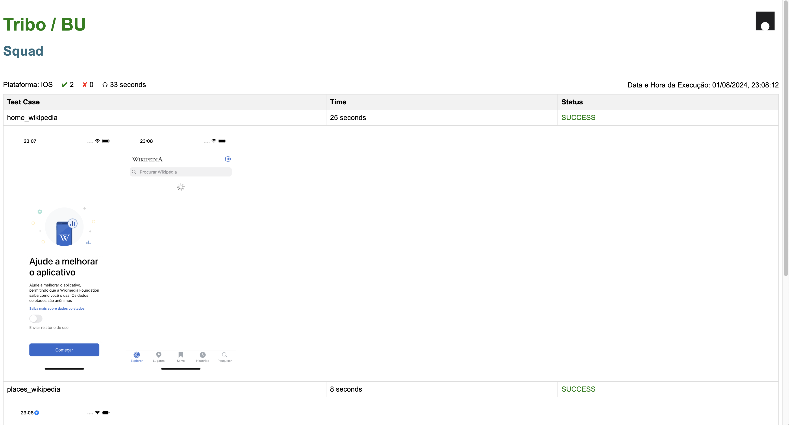

# Repositório de Testes Mobile com Maestro

  

Este repositório contém os testes automatizados para aplicações mobile utilizando a ferramenta Maestro da Mobile.dev. Abaixo você encontrará as instruções para instalação e execução dos testes em diferentes sistemas operacionais.

  

## Instalação no macOS

  

### Dependências

  

- Xcode versão 14 ou superior. [Link para a página do Xcode](https://developer.apple.com/xcode/)

- Command Line Tools instaladas (Xcode -> Preferences -> Locations -> Command Line Tools)

  

### Passos para Instalação

  

1. Abra o terminal e execute os seguintes comandos:

  

```sh

brew tap mobile-dev-inc/tap

brew install maestro

```

  

2. Para executar flows no iOS Simulator, é necessário instalar a ferramenta Facebook IDB. [IDB](https://fbidb.io/)

```sh

brew tap facebook/fb

brew install facebook/fb/idb-companion

```

  

## Instalação no Windows

  

### Pré-Requisitos

  

- PowerShell deve estar instalado em seu sistema Windows.

- Instale o Android Studio em sua máquina Windows.

- Adicione `ANDROID_HOME` à variável de ambiente do Windows.

- Para verificar se a configuração do `ANDROID_HOME` está correta, abra um terminal PowerShell e execute o comando `adb --version`. Anote a versão do ADB.

- Instale o Java JDK 11 e configure o `JAVA_HOME`.

- Execute `java --version` para verificar se o Java está instalado corretamente.

  

### Passos para Instalação

  

1. Instale o WSL2 (Window Subsystem for Linux):

  

```sh

wsl --install

sudo apt update

sudo apt upgrade

```

  

2. Instale o Java 21:

  

```sh

sudo apt install openjdk-21-jdk

```

  

3. Instale o Maestro:

  

```sh

curl -Ls "https://get.maestro.mobile.dev"  |  bash

```

## Configuração do Ambiente Android

Para configurar emuladores Android, siga os passos abaixo:

### Instale o Android Studio:

- Faça o download do Android Studio a partir do [site oficial](https://developer.android.com/studio).
- Siga as instruções de instalação específicas para o seu sistema operacional.

### Configure o Android Virtual Device (AVD):

- Abra o Android Studio.
- Vá para `Tools > AVD Manager`.
- Clique em `Create Virtual Device`.
- Selecione o dispositivo e a versão do Android desejados.
- Siga as instruções para concluir a configuração do AVD.

### Inicie o Emulador:

- No AVD Manager, selecione o emulador criado e clique em `Launch`.

## Configuração do Ambiente iOS

Para configurar emuladores iOS com WebDriverAgent, siga os passos abaixo:

### Clone o Repositório WebDriverAgent:

- Abra o Terminal e execute o comando:

```sh

git clone https://github.com/facebookarchive/WebDriverAgent.git

```

- Navegue até o diretório do WebDriverAgent:

- Execute o Script de Bootstrap:

```sh

./Scripts/bootstrap.sh

```

- Instale o Carthage:

```sh

brew install carthage

```

- Abra o projeto WebDriverAgent.xcodeproj

- No Xcode, selecione o target IntegrationApp.

- Escolha o dispositivo (device) desejado.

- Clique em Build para compilar o projeto.


## Configuração do Repositório

  

Neste repositório, estamos utilizando dependências para gerar o status report. Após clonar o repositório, instale as dependências com o comando:

  

```sh

npm  install

```

  

## Mapeamento dos Elementos

  

Para  mapear  os  elementos  no  seu  app  Android  ou  iOS,  execute  o  comando:

  

```sh

maestro studio

```

Mais informações sobre o maestro, veja em [https://maestro.mobile.dev/](https://maestro.mobile.dev/)


## Estrutura dos Flows

  

Os flows de teste devem ser criados na pasta tests.

  

## Execução dos Testes

  

Para executar os testes, utilize o comando:

  

```sh

npm  run  tests

```
## Status Report

Após a conclusão da execução dos testes, o status report é gerado na pasta `html-report`. Este relatório inclui informações detalhadas sobre os testes executados, como o tempo de execução, o status de sucesso ou falha de cada teste e evidências em forma de capturas de tela.

### Exemplo de Status Report gerado

Veja abaixo um exemplo de como o relatório gerado se parece:



O relatório contém as seguintes seções:

- **Plataforma**: Indica se os testes foram executados em um dispositivo Android ou iOS.
- **Test Cases**: Lista todos os casos de teste executados, juntamente com o tempo de execução e o status.
- **Evidências**: Inclui capturas de tela tiradas durante a execução dos testes para ajudar na verificação visual dos resultados.

O status report é uma ferramenta valiosa para garantir a qualidade e a funcionalidade da aplicação, fornecendo uma visão clara e detalhada de cada execução de teste.


